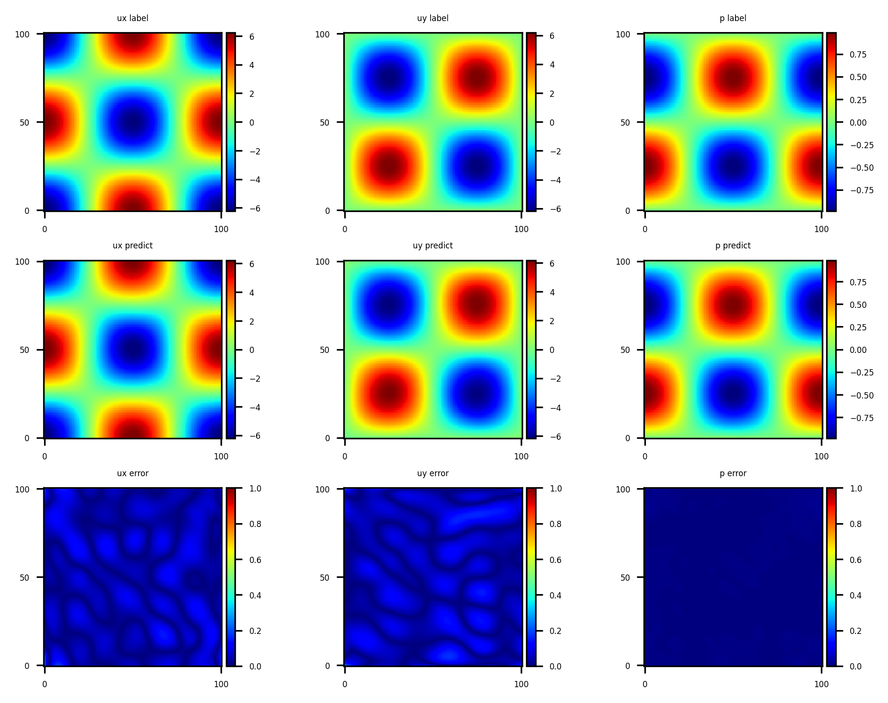

# 二维定常达西问题

## 环境安装

要求 **MindSpore >= 2.0.0** 版本以调用如下接口: *mindspore.jit, mindspore.jit_class, mindspore.data_sink*。具体请查看[MindSpore安装](https://www.mindspore.cn/install)。

此外，需要安装 **MindFlow >=0.1.0** 版本。如果当前环境还没有安装，请按照下列方式选择后端和版本进行安装。

除此之外，代码在华为的modelarts上运行，使用mindspore1.7.0-cuda10.1-py3.7-ubuntu18.04的镜像，规格为GPU: 1*Pnt1(16GB)|CPU: 8核 64GB。

由于原镜像采用**mindspore-gpu==1.7.0**，不符合项目需求，直接安装**mindspore==2.2.14**虽然可以成功，但是会和之前的mindspore-gpu发生冲突，所以需要先卸载mindspore-gpu再安装mindspore官网安装mindspore2.2.14。


```python
mindflow_version = "0.1.0"  # update if needed
# 安装mindflow
!pip uninstall -y mindflow-gpu
!pip install mindflow-gpu==$mindflow_version

# 卸载并重新安装正确版本的mindspore
!pip uninstall mindspore-gpu
!pip install https://ms-release.obs.cn-north-4.myhuaweicloud.com/2.2.14/MindSpore/unified/x86_64/mindspore-2.2.14-cp37-cp37m-linux_x86_64.whl --trusted-host ms-release.obs.cn-north-4.myhuaweicloud.com -i https://pypi.tuna.tsinghua.edu.cn/simple
```

## 概述

达西方程（Darcy equation）是一个描述了流体在多孔介质中低速流动时渗流规律的二阶椭圆型偏微分方程，被广泛应用于水利工程，石油工程等领域中。达西方程最初由亨利·达西根据沙土渗流实验的实验结果制定，后来由斯蒂芬·惠特克通过均质化方法从纳维-斯托克斯方程推导出来。

由于对于不同流体的渗流情况，达西方程难以得到泛化的解析解。通常采用数值方法对描述特定场景的达西控制方程进行求解，进而对该场景下渗流的压力场和速度场进行仿真。利用达西渗流的数值仿真结果，可以进一步施行科学研究和工程实践。传统达西方程的数值求解通常采用有限元法（finite element method，FEM），此外，在实践中，达西方程的一些物理项会被定常化。有限元法被设计在标准的有限元网格空间，数值求解要求的精度越高，网格需要被划分得越精细，时间开销和存储开销会变得越大。

随着数值求解的并行算法研究趋于放缓，利用基于神经网络的方法开始得到发展并取得了接近传统数值方法的求解精度。在2019年，布朗大学应用数学团队提出了一种基于物理信息的神经网络（Physics-informed Neural Networks，PINNs）并给出了完整构建PINNs的代码体系用于求解多种多样的偏微分方程。本案例利用MindFlow流体方程套件，使用基于PINNs的方法，求解二维定常达西方程。

## 问题描述

考虑二维正方体$\Omega=(0, 1)\times(0, 1)$，该正方体的边界为$\Gamma$。忽略重力的影响，在$\Omega$的范围内，流体压力$p$和速度$u$满足的定常2D Darcy方程如下：

$$
\begin{align}
u + \nabla p &= 0, (x, y)\in\Omega\\
\nabla \cdot u &= f, (x, y)\in\Omega
\end{align}
$$

本案例使用迪利克雷边界条件，形式如下：

$$
\begin{align}
u_x &= -2 \pi cos(2 \pi x) cos(2 \pi y) &(x, y)\in\Gamma\\
u_y &= 2 \pi sin(2 \pi x) sin(2 \pi y) &(x, y)\in\Gamma\\
p &= sin(2 \pi x) cos(2 \pi y) &(x, y)\in\Gamma
\end{align}
$$

其中$f$为Darcy微分方程中的**forcing function**。本案例利用PINNs学习**forcing function** $f$为$8 \pi^2 sin(2 \pi x)cos(2 \pi y)$时位置到相应物理量的映射$(x, y) \mapsto (u, p)$，实现对Darcy方程的求解。

## 技术路线

MindFlow求解2D定常达西方程的具体流程如下：

1. 创建数据集。

2. 构建模型。

3. 优化器。

4. 2D Darcy。

5. 模型训练。

6. 模型推理和可视化。


```python
import time

import numpy as np

from mindspore import context, nn, Tensor, ops, jit, set_seed, data_sink
from mindspore import dtype as mstype
from sympy import Function, symbols, sin, cos, pi
```

下述`src`包可以在[applications/physics_driven/darcy/src](https://gitee.com/mindspore/mindscience/tree/master/MindFlow/applications/physics_driven/darcy/src)下载。


```python
from mindflow.utils import load_yaml_config
from mindflow.cell import FCSequential
from mindflow.pde import PDEWithLoss, sympy_to_mindspore


from src import create_training_dataset, create_test_dataset
from src import calculate_l2_error

set_seed(123456)
np.random.seed(123456)
```

#### 错误修改

配置文件名字为darcy.yaml，作者使用的是darcy_cfg.yaml。


```python
# set context for training: using graph mode for high performance training with GPU acceleration
# config = load_yaml_config("configs/darcy_cfg.yaml")
config = load_yaml_config("configs/darcy.yaml")
context.set_context(mode=context.GRAPH_MODE, device_target="GPU", device_id=0)
use_ascend = context.get_context(attr_key='device_target') == "Ascend"
```

### 创建数据集

对于训练数据集，本案例根据问题域及边值条件进行随机采样，采样配置信息如下，根据均匀分布采样。构建平面正方形的问题域，再对已知的问题域和边界进行采样。

#### 错误修改

作者原先获取批处理大小使用的是代码batch_size=config["train_batch_size"]，然而在配置文件中并没有**train_batch_size**变量，按照配置文件中的设置，修改代码为batch_size=config["data"]["train"]["batch_size"]。


```python
# create train dataset
geom_name = "flow_region"
flow_train_dataset = create_training_dataset(config, geom_name)
train_data = flow_train_dataset.create_dataset(
    # batch_size=config["train_batch_size"], shuffle=True, drop_remainder=True
    batch_size=config["data"]["train"]["batch_size"], shuffle=True, drop_remainder=True
)

# create test dataset
test_input, test_label = create_test_dataset(config)
```

### 构建模型

本案例使用层数为6层，每层128个神经元的神经网络结构，其中包含6层全连接层和5层残差层，激活函数是tanh函数。残差层可以有效使得梯度在每层传递中不消失，使得更深的网络结构成为可能。


```python
# network model
model = FCSequential(in_channels=config["model"]["in_channels"],
                     out_channels=config["model"]["out_channels"],
                     neurons=config["model"]["neurons"],
                     layers=config["model"]["layers"],
                     residual=config["model"]["residual"],
                     act=config["model"]["activation"],
                     weight_init=config["model"]["weight_init"])
```

## 优化器


```python
# optimizer
params = model.trainable_params()
optimizer = nn.Adam(params, learning_rate=config["optimizer"]["learning_rate"])
```

## 2D Darcy

下述Darcy2D将达西问题同数据集关联起来，包含2个部分：控制方程，边界条件。


```python
class Darcy2D(PDEWithLoss):
    def __init__(self, model, loss_fn=nn.MSELoss()):
        self.x, self.y = symbols("x y")
        self.u = Function("u")(self.x, self.y)
        self.v = Function("v")(self.x, self.y)
        self.p = Function("p")(self.x, self.y)
        self.in_vars = [self.x, self.y]
        self.out_vars = [self.u, self.v, self.p]
        self.loss_fn = loss_fn
        self.bc_nodes = sympy_to_mindspore(self.bc(), self.in_vars, self.out_vars)
        super(Darcy2D, self).__init__(model, self.in_vars, self.out_vars)

    def force_function(self, x, y):
        return 8 * pi**2 * sin(2 * pi * x) * cos(2 * pi * y)

    def pde(self):
        loss_1 = (
            self.u.diff(self.x)
            + self.v.diff(self.y)
            - self.force_function(self.x, self.y)
        )
        loss_2 = self.u + self.p.diff(self.x)
        loss_3 = self.v + self.p.diff(self.y)
        return {"loss_1": loss_1, "loss_2": loss_2, "loss_3": loss_3}

    def bc(self):
        u_boundary = self.u - (-2 * pi * cos(2 * pi * self.x) * cos(2 * pi * self.y))

        v_boundary = self.v - (2 * pi * sin(2 * pi * self.x) * sin(2 * pi * self.y))

        p_boundary = self.p - (sin(2 * pi * self.x) * cos(2 * pi * self.y))

        return {
            "u_boundary": u_boundary,
            "v_boundary": v_boundary,
            "p_boundary": p_boundary,
        }

    def get_loss(self, pde_data, bc_data):
        pde_res = ops.Concat(1)(self.parse_node(self.pde_nodes, inputs=pde_data))
        pde_loss = self.loss_fn(
            pde_res, Tensor(np.array([0.0]).astype(np.float32), mstype.float32)
        )

        bc_res = ops.Concat(1)(self.parse_node(self.bc_nodes, inputs=bc_data))
        bc_loss = self.loss_fn(
            bc_res, Tensor(np.array([0.0]).astype(np.float32), mstype.float32)
        )

        return pde_loss + bc_loss
```

## 模型训练

使用MindSpore >= 2.0.0的版本，可以使用函数式编程范式训练神经网络。


```python
def train():
    # define problem
    problem = Darcy2D(model)

    # prepare loss scaler
    if use_ascend:
        from mindspore.amp import DynamicLossScaler, all_finite, auto_mixed_precision
        loss_scaler = DynamicLossScaler(1024, 2, 100)
        auto_mixed_precision(model, 'O3')
    else:
        loss_scaler = None

    def forward_fn(pde_data, bc_data):
        loss = problem.get_loss(pde_data, bc_data)
        if use_ascend:
            loss = loss_scaler.scale(loss)
        return loss

    grad_fn = ops.value_and_grad(forward_fn, None, optimizer.parameters, has_aux=False)

    @jit
    def train_step(pde_data, bc_data):
        loss, grads = grad_fn(pde_data, bc_data)
        if use_ascend:
            loss = loss_scaler.unscale(loss)
            is_finite = all_finite(grads)
            if is_finite:
                grads = loss_scaler.unscale(grads)
                loss = ops.depend(loss, optimizer(grads))
            loss_scaler.adjust(is_finite)
        else:
            loss = ops.depend(loss, optimizer(grads))
        return loss

    epochs = config["data"]["train"]["epochs"]
    steps_per_epochs = train_data.get_dataset_size()
    sink_process = data_sink(train_step, train_data, sink_size=1)

    for epoch in range(1, 1 + epochs):
        local_time_beg = time.time()
        model.set_train(True)
        for _ in range(steps_per_epochs):
            cur_loss = sink_process()
        print(f"epoch: {epoch} train loss: {cur_loss} epoch time: {(time.time() - local_time_beg) * 1000 :.3f} ms")
        model.set_train(False)
        if epoch % config["summary"]["eval_interval_epochs"] == 0:
            calculate_l2_error(model, test_input, test_label, config["data"]["train"]["batch_size"])
```


```python
start_time = time.time()
train()
print("End-to-End total time: {} s".format(time.time() - start_time))
```

    u_boundary: u(x, y) + 2*pi*cos(2*pi*x)*cos(2*pi*y)
        Item numbers of current derivative formula nodes: 2
    v_boundary: v(x, y) - 2*pi*sin(2*pi*x)*sin(2*pi*y)
        Item numbers of current derivative formula nodes: 2
    p_boundary: p(x, y) - sin(2*pi*x)*cos(2*pi*y)
        Item numbers of current derivative formula nodes: 2
    loss_1: -8*pi**2*sin(2*pi*x)*cos(2*pi*y) + Derivative(u(x, y), x) + Derivative(v(x, y), y)
        Item numbers of current derivative formula nodes: 3
    loss_2: u(x, y) + Derivative(p(x, y), x)
        Item numbers of current derivative formula nodes: 2
    loss_3: v(x, y) + Derivative(p(x, y), y)
        Item numbers of current derivative formula nodes: 2
    epoch: 100 train loss: 6.8784714 epoch time: 1523.571 ms
        predict total time: 534.3403816223145 ms
        l2_error:  0.5755849074109586
    ==================================================================================================
    epoch: 200 train loss: 0.6278709 epoch time: 1471.620 ms
        predict total time: 145.03049850463867 ms
        l2_error:  0.045125807781619925
    ==================================================================================================
    ...
    epoch: 3800 train loss: 0.0044780443 epoch time: 1648.896 ms
        predict total time: 624.0160465240479 ms
        l2_error:  0.006336488966235181
    ==================================================================================================
    epoch: 3900 train loss: 0.010450709 epoch time: 1453.108 ms
        predict total time: 3.2355785369873047 ms
        l2_error:  0.007389579493622406
    ==================================================================================================
    epoch: 4000 train loss: 0.023211665 epoch time: 1587.883 ms
        predict total time: 293.90811920166016 ms
        l2_error:  0.008666194314787058
    ==================================================================================================
    End-to-End total time: 6409.854037761688 s


#### 参数保存

由于训练一次神经网络需要花费非常长的时间，接近4个小时，我们选择将模型的参数保存在本地，下次需要观察结果只需加载模型参数即可。


```python
from mindspore import save_checkpoint

save_checkpoint(model, "darcy2D.ckpt")
```

#### 加载模型参数


```python
from mindspore import load_checkpoint, load_param_into_net

ckpt_file_name = 'darcy2D.ckpt'
param_dict = load_checkpoint(ckpt_file_name)
param_not_load, _ = load_param_into_net(model, param_dict)
```

### 模型推理和可视化

训练后可对流场内所有数据点进行推理，并可视化相关结果。

#### 错误修改

作者提供的src文件夹中的**visual**函数存在问题：
在可视化预测结果的过程中，需要从模型预测中分别提取出**ux**，**uy**，**p**的预测值，作者提取预测值的代码（src/utils.py中visual函数的部分代码）如下：


```python
for i in range(config["model"]["in_channels"]):
    test_batch = Tensor(visual_input[index:index_end, :], dtype=mstype.float32)
    predict = model(test_batch)
    predict = predict.asnumpy()
    prediction[index:index_end, i] = predict[:, i]

visual_fn(visual_label, prediction.reshape(visual_label.shape), "./images", name)

ux_pred = predict[:, 0]
uy_pred = predict[:, 1]
p_pred = predict[:, 2]
```

配置文件中的**in_channels**为2，但是需要预测的变量有三个，这样就导致得到的**p_pred**中的元素全为0，从而得到错误的p的预测结果，可视化后的结果自然也是错误的。

于是，我们将config["model"]["in_channels"]改为config["model"]["out_channels"]，其中**out_channels**等于3，这样就能得到所有变量正确的预测结果了。


```python
from src import visual
visual(model, config)
```


    

    

